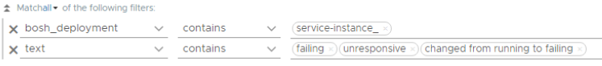

VMware Advanced Customer Engagements (ACE) Team

Authored by Sajal Debnath

June 2020

Table of contents
=================

[Purpose](#purpose)

[Monitoring a TKGI environment](#monitoring-a-tkgi-environment)

[Who monitors what?](#who-monitors-what)

[Example Metrics](#example-metrics)

[Different tools for different layers](#different-tools-for-different-layers)

[Flow of monitoring and troubleshooting](#flow-of-monitoring-and-troubleshooting)

[Current Available options](#currently-available-options)

[Missing Layer from Monitoring](#missing-layer-from-monitoring)

[TKGI Control Plane](#tkgi-control-plane)

[Metrics to Monitor](#metrics-to-monitor)

[Assumptions](#assumptions)

[Environment](#environment)

[Result -- How it would look](#result-how-it-would-look)

[vRealize Operations Manager](#vrealize-operations-manager)

[vRealize Network Insight](#vrealize-network-insight)

[vRealize Log Insight](#vrealize-log-insight)

[Custom configuration details](#custom-configuration-details)

[vRealize Operations Manager](#vrealize-operations-manager-1)

[Group Types](#group-types)

[Custom Groups](#custom-groups)

[Object Relationship](#object-relationship)

[Metric Configurations](#metric-configurations)

[Custom Dashboard](#custom-dashboard)

[vRealize Network Insight](#vrealize-network-insight-1)

[Defining the Application](#defining-the-application)

[vRealize Log Insight](#vrealize-log-insight-1)

[Conclusion](#conclusion)

[Acknowledgement](#acknowledgement)

[Glossary](#glossary)

Purpose
=======

With the ever-increasing use of containerized applications, we see a
significant proliferation of related technologies in modern datacenters.
These latest technologies have brought newer responsibilities for the
datacenter teams, for example, monitoring these environments for
continuous operation and performance. Since the architecture of these
related technologies is different hence their components and monitoring
process is also different. One such example is VMware Tanzu Kubernetes
Grid Integrated (TKGI), formerly known as Enterprise PKS. VMware Tanzu
Kubernetes Grid Integrated or TKGI is a Kubernetes-based container
solution with advanced networking, a private container registry, and
life cycle management. TKGI simplifies the deployment and operation of
Kubernetes clusters so you can run and manage containers at scale on
private and public clouds.

The question under consideration is what to monitor for in the deployed
TKGI environment and how to monitor these. The next question is what to
do or how to react to the issues we face in the monitored components.

This document provides answers to all these questions. It guides to what
to monitor and how to monitor in a datacenter hosting TKGI environment.
Also, this document provides best practices and general guidelines for
monitoring such an environment. Though there are many ways we can
monitor a TKGI environment, this document covers the VMware suite of
products that is used to monitor TKGI environment including vRealize
Network Insight, vRealize Operations Manager, and vRealize Log Insight.

Monitoring a TKGI environment
=============================

Before we delve into the details of monitoring a TKGI environment, it is
imperative to understand the different aspects of a TKGI environment.
Also, it is important to understand the different roles and
responsibilities for monitoring the environment. This section covers
about those details of monitoring a TKGI environment.

Who monitors what?
------------------

Provided below is a list showing the different layers in a TKGI
environment and who monitors which layers. Also, it provides a sample of
the monitoring areas these roles may monitor.

Pic 1: Different TKGI environment layers and the monitoring
responsibility of the different teams

Note, the roles need not be mutually exclusive, and they may slightly
overlap at times based on the organizational structures.

Example Metrics
---------------

The following picture contains a list of metrics to monitor a different
layer of a TKGI environment. This list is an example list and does not
include all the possible metrics to watch in the environment.

Pic 2: A sample list of metrics to monitor in the different TKGI
environment layers

Different tools for different layers
------------------------------------

The below picture provides a pictorial view of different TKGI layers and
the choice of VMware tools used to monitor those layers.

Pic 3: Different TKGI environment layers and the VMware tools to monitor
those

Flow of monitoring and troubleshooting
--------------------------------------

Usually, for different layers, the respective teams monitor and maintain
the health of that layer. If something breaks, teams quickly observe and
rectify issues. But the performance-related issues are hard to
troubleshoot. Typically, the end-users or developers notify other teams
about the problem they face. Provided below is a pictorial view of the
different layers, teams responsible for them, VMware tools used to
monitor those, and the general flow of troubleshooting issues in TKGI
overall environment.

Pic 4: General flow of troubleshooting issues in TKGI overall
environment

Currently available options
---------------------------

To showcase and explore existing options please follow the path,
products and information provided in the below picture.

 Pic 5: Existing options in different
VMware products to monitor a TKGI environment

Missing Layer from Monitoring
-----------------------------

In Pic 3, we have defined the layers present in the TKGI environment and
the current monitoring options for them. But if we look closely, we can
see there is a layer missing from default monitoring options. That layer
is the TKGI Control Plane layer. Currently, there is no default or out
of the box solution available to monitor specifically the TKGI control
plane/management plane components. Let's focus on that layer now.

Pic 6: Missing layer in TKGI monitoring

In this document, we describe the missing layer and how to monitor it.
We provide details on how to customize the different existing VMware
products to monitor that layer in detail.

TKGI Control Plane
==================

Let's discuss TKGI control plane components in detail and the different
failure areas in those components. Provided below is a picture showing
the different components and the primary services that we need to
monitor.

Pic 7: TKGI Control Plane components and major services

Metrics to Monitor
------------------

Attached is an excel document with a list of the major metrics to
monitor for these components. You can download and check the file from
<https://github.com/sajaldebnath/tkgi-monitoring/blob/master/PKS%20Environment%20Monitoring.xlsx>.

In the below sections, we will discuss custom options and how to
configure those in the following three VMware products.

- vRealize Operations Manager (vROps)

- vRealize Network Insight (vRNI)

- vRealize Log Insight (vRLI)

Assumptions
===========

The following assumptions are made in the guide:

- A TKGI environment is deployed and ready for monitoring.

- This guide will use the following VMware tools for monitoring.
  
  - VMware vRealize Operations Manager
  
  - VMware vRealize Log Insight
  
  - VMware vRealize Network Insight

- It is assumed the above mentioned VMware products are deployed and
  integrated together.

Environment
===========

This document was prepared based on the following products and versions.

| Product     |   Component     |       Version|
|-------------|-----------------|---------------|
|vRealize Operations Manager |  Core Product  | 8.1 |
|  | VMware vRealize Operations Management Pack for Container Monitoring | 1.4.3.15987816 |
| | SDDC Management Health   | 8.1.15995854
| | NSX-T Management Pack (Default out of the box) | 8.1.15972155
| vRealize Network Insight | Core Product | 5.2.0.1585846638
|vRealize Log Insight | Core Product  | 8.1.0-15994158
| | VMware - Enterprise PKS (Community Supported) | 1.0
| | VMware - NSX-T | 3.8.2

Result -- How it would look
===========================

Before we start discussing about various configuration steps, let's have
a look at what we want to achieve. Provided below is a picture showing
the flow of the custom solutions in different products.

Pic 8: Flow of different custom dashboard in various products

vRealize Operations Manager
---------------------------

Let's start with a Customer Dashboard in vRealize Operations Manager
(vROps).

Pic 9: TKGI Dashboard -- Custom Dashboard in vROps

vRealize Network Insight
------------------------

Next, we have a custom dashboard configured in vRealize Network Insight.

Pic 10: TKGI-Group-1 Dashboard -- Custom Dashboard in vRNI -- pic 1

Pic 11: TKGI-Group-1 Dashboard -- Custom Dashboard in vRNI -- pic 2

Pic 12: TKGI-Group-1 Dashboard -- Custom Dashboard in vRNI -- pic 3

Pic 13: TKGI-Group-1 Dashboard -- Custom Dashboard in vRNI -- pic 4

vRealize Log Insight
--------------------

Next, we have a custom dashboard configured in vRealize Log Insight.

Pic 14: TKGI Dashboard -- Overall -- Custom Dashboard in vRLI -- pic 1

Pic 15: TKGI NSX-T Dashboard -- Custom Dashboard in vRLI -- pic 2

Pic 16: TKGI - Audit Dashboard Custom Dashboard in vRLI -- pic 3

Custom configuration details
============================

In the section, we discuss the various configuration details required in
the VMware products to get the solution that we are looking for.

vRealize Operations Manager
---------------------------

In this section, we discuss about configuring a custom dashboard to
monitor the TKGI Control plane components in vROps. Before we start,
provided below is a picture depicting different TKGI layers and their
relationships in the dashboard.

Pic 17: Custom dashboard components and relationships

**Explanation of the dashboard components:**

- The top layer shows as list of different TKGI environment (if the
  environment has more than one TKGI clusters, it will be listed here)

- Once clicked, it will show list in second layer. The underlying
  NSX-T control plane and the TKGI control plane

- Clicking on individual items in the second layer will show the list
  of components under that group in third layer

- Clicking on the items in third layer will show the individual
  component metrics

Above is a relation of the components and groups. Apart from that, there
will be events view and a relationship view as well.

**How to Build**:

To build this we need to configure the following:

- Group Types

- Custom Groups

- Object Relationships

- Metric Configuration

- Custom Dashboard

The purpose is to build a custom dashboard that shows all the TKGI
Control Plane components. By looking at this dashboard, we should be
able to tell at a glance whether the environment is healthy or not.

### Group Types

We start the configuration with custom group types. We need to create
three custom group type. Create three custom group type by going to
Administration Configuration Group Types ADD. Name and purpose for the
group types are provided below.

| Name of the group type | Purpose
|------------------------|-------------
| NSX-T MGMT    | Will be used to group together all the NSX-T environments
| TKGI-MGMT     |Will be used to group together all the control plane objects of TKGI Cluster
| TKGI Group    | Will be used to group together the "NSX-T MGMT" and TKGI-MGMT type group objects

Table 1: Group Type details

### Custom Groups

Next, we will configure custom groups. Go to Environment Environment
Overview Custom Groups ADD to add custom groups. We will configure three
custom groups.

| Name of the custom group | Purpose |
|---------------------------|---------|
|TKGI Group-1  | Used to represent Layer 1 objects depicted in Pic 17. Groups together TKGI MGMT and NSX-T environment components. Shows overall health of an environment.
|TKGI Management-1  | Used to represent Layer 2 objects depicted in Pic 17. Groups together TKGI MGMT components. Shows overall health of TKGI control plane components.
|NSX-T Environment-1 | Used to represent Layer 2 objects depicted in Pic 17. Groups together NSX-T control plane components. Shows overall health of NSX-T control plane objects.

Table 2: Custom Group Type details

**Note,** since I have only one TKGI environment, I have 3 groups. If
you have more than one environment, then, you need to create that many
groups. For example, if you have 3 different TKGI environment, then you
need to create 3 x 3 = 9 total custom groups. The purpose of base 3
groups are same.

Provided below are the details of the individual groups.

**TKGI Management-1**

Purpose of this custom group is to group all the TKGI control plane
elements. This is a second layer entity. Details of the group is
provided below.

Name: TKGI Management-1

Group Type: TKGI-MGMT

Define Membership Criteria:

- Ops Manager
  
  - Object Type: Virtual Machine
  
  - Properties(Summary\|Configuration\|Product Name) contains Ops
    Manager
    
    AND
  - Relationship Descendant of is Cluster Name (e.g. RegionA01-MGMT)

- Bosh
  
  - Object Type: Virtual Machine
  
  - Properties(Summary\|Custom Tag:instance\_group\|Value) contains
    bosh
    
    AND

  - Relationship Descendant of is Cluster Name (e.g. RegionA01-MGMT)

- Harbor App
  
  - Object Type: Virtual Machine
  
  - Properties(Summary\|Configuration\|Product Name) contains
    harbor-app
    
    AND

  - Relationship Descendant of is Cluster Name (e.g. RegionA01-MGMT)

- PKS DB
  
  - Object Type: Virtual Machine
  
  - Properties(Summary\|Configuration\|Product Name) contains pks-db

    AND

  - Relationship Descendant of is Cluster Name (e.g. RegionA01-MGMT)

- Pivotal-container-service (PKS API)
  
  - Object Type: Virtual Machine
  
  - Properties(Summary\|Configuration\|Product Name) contains
    pivotal-container-service
    
    AND

  - Relationship Descendant of is Cluster Name (e.g. RegionA01-MGMT)

- Enterprise PKS (EPMC)
  
  - Object Type: Virtual Machine
  
  - Properties(Summary\|Configuration\|Product Name) contains
    Enterprise PKS

    AND

  - Relationship Descendant of is Cluster Name (e.g. RegionA01-MGMT)

**Please note,** in my case, the distinction between the environments is
the cluster name. In a cluster I will host only a single TKGI
environment. That is the reason I got Cluster as a defining criterion.
In your case if something else is defining criteria, please select that
instead of cluster. For example, if you have multiple datacenters or
vCenter servers and decide to create a TKGI environment per Datacenter
or vCenter Server, then please select Datacenter or vCenter Server as
the deciding factor.

Anyways, for multiple TKGI environment, create multiple groups like
"TKGI Management-1", "TKGI Management-2", "TKGI Management-n" etc. with
each group containing the control plane components pertaining to that
group only (based on the selection criteria).

A sample screenshot is provided below.

Pic 18: Details of custom group TKGI Management-1

**NSX-T Environment-1**

Purpose of this custom group is to group all the NSX-T control plane
elements. This is a second layer entity. Details of the group is
provided below.

Name: NSX-T Environment-1

Group Type: NSX-T MGMT

Define Membership Criteria:

- NSX-T Managers
  
  - Object Type: Virtual Machine
  
  - Properties(Summary\|Configuration\|Product Name) contains
    nsx-unified-appliance
  
    AND

  - Relationship Descendant of is Cluster Name (e.g. RegionA01-MGMT)

- NSX Edges
  
  - Object Type: Virtual Machine
  
  - Properties(Summary\|Configuration\|Product Name) contains
    nsx-edge

    AND

  - Relationship Descendant of is Cluster Name (e.g. RegionA01-MGMT)

**Please note,** in my case, the distinction between the environments is
the cluster name. In a cluster, I will host only a single NSX-T
environment. That is the reason, I got Cluster as a defining criterion.
In your case, if something else is defining criteria, please select that
instead of cluster. For example, if you have multiple datacenters or
vCenter servers and decide to create an NSX-T environment per Datacenter
or vCenter Server, then please select Datacenter or vCenter Server as
the deciding factor.

Anyways, for multiple NSX-T environment, create multiple groups like
"NSX-T Environment-1", "NSX-T Environment-2", "NSX-T Environment-n" etc.

- with each group containing the control plane components pertaining to
  that group only (based on the selection criteria).

A sample screenshot is provided below:

Pic 19: Details of custom group NSX-T Environment-1

**TKGI Group-1**

Purpose of this custom item is to group all the elements of the TKGI
environment. Details for the custom group is provided below:

Pic 20: Details of custom group TKGI Group-1

**Please note,** the Group Type is "TKGI Group". Also, under the
membership criteria we selected "TKGI Management-1" and "NSX-T
Environment-1". For multiple TKGI environments, create multiple custom
groups and name them accordingly so that They can be

"TKGI Group-2" ( "TKGI Management-2" + "NSX-T Environment-2")

"TKGI Group-n" ( "TKGI Management-n" + "NSX-T Environment-n")

and so on.

### Object Relationship

Next, we will define a customer object relationship between the defined
custom groups and the environment.

Go to **Administration Configuration Object Relationship** and make sure
the following relationships exist:

| **Parent Selection**             | **Children**                     |
|----------------------------------|----------------------------------|
| TKGI Group-1 (under TKGI Group)  | NSX-T Environment-1          |
|                                  | TKGI Management-1            |
| TKGI Management-1 (under TKGI-MGMT) | Shows all the 6 components of TKGI control plane (epmc,opsman, bosh, harbor, pks-db, pks api)                         |
| NSX-T Environment-1 (under NSX-T MGMT) | Shows all the management component of NSX-T environment (nsx manager and nsx edge)       |
| RegionA01-MGMT (cluster under Cluster Compute Resource)    | Should contain TKGI Group-1 apart from other children        |

Table 3: Object Relationship details

**Please note,** the above relationship is for one group only. If you
have more than one group (environment) then check all of them
accordingly. The major relationship that you need to configure is add
"TKGI Group-1" under the Cluster (RegionA01-MGMT in my case) by dragging
it from right side list to the top of the box.

Pic 21: A sample screenshot is provided

### Metric Configurations

Next step is to define the metric configuration for showing the output.
We configure two custom metric configuration "TKGI Individual Health
Scoreboard" and "TKGI Component Properties" to showcase the outputs in
the custom dashboard. To configure this, go to Administration Metric
Configurations ReskndMetric ADD

**Name:** TKGI Individual Health Scoreboard

**Name:** TKGI Component Properties

### Custom Dashboard

The last step is to configure the custom dashboard. Download the
Dashboard zip file from GitHub repository -
[*https://github.com/sajaldebnath/tkgi-monitoring/blob/master/TKGI%20Dashboard.zip*](https://github.com/sajaldebnath/tkgi-monitoring/blob/master/TKGI%20Dashboard.zip).
The file name is "TKGI Dashboard.zip". Once downloaded, import it in
vROps by going to Dashboards Manage Dashboards Import.

Once all the above are done, the dashboard for TKGI components are ready
in vRealize Operations Manager.

vRealize Network Insight
------------------------

Next product is vRealize Network Insight (vRNI). We need to configure
this in two steps. In the first step, we need to define an application.
In the second step, we need to define a pinboard and add widgets from
application and NSX-T information to this pinboard.

Remember, dashboards in vRNI is called pinboards. So vROps dashboards
and vRNI pinboards are essentially the same thing.

### Defining the Application

Let's define the application first. Go to Plan & Assess Applications Add
Application (manual)

We will define 6 Tiers for the 6 components, namely opsman, Bosh,
PKS-DB, Harbor, Pivotal Container Service, EPMC. Provided below are the
details of each Tier.

- Name: opsman
  
  - Member: Custom VM Search VMs where Name like opsman and Cluster
    like \'RegionA01-MGMT\'

- Name: EPMC
  
  - Member: Custom VM Search VMs where Name like epmc and Cluster
    like \'RegionA01-MGMT\'

- Name: Bosh
  
  - Member: VM Names \'vm-ebc8a6e7-2aba-4cd2-b82d-22151a53d3bf\'

- Name: PKS-DB
  
  - Member: VM Names \'vm-3c0c2f84-1d59-45a8-82d0-dcdaa3d5e8a4\'

- Name: Harbor
  
  - Member: VM Names \'vm-63b64727-bf32-43da-ab90-947825fd9708\'

- Name: Pivotal Container Service
  
  - Member: VM Names \'vm-2283bdc6-d012-482f-95dd-97e98f48039d\'

**Note:** The VM name for Bosh, PKS-DB, Harbor and Pivotal Container
Service will be different from environment to environment. So, please
make changes accordingly. Also, vRNI does not have visibility into the
VM to search for the name inside the VM (like we can in vROps). So, we
will have to either depend on the VM naming pattern in vCenter or get
the exact VM name. For OpsMan and EPMC the naming pattern exists and so
we can search for them in a particular cluster but not for other
components. If you want to find the VMs by the VM name and dynamically
update the VM membership, then following the instructions given at
<https://bosh.io/docs/vsphere-human-readable-names/>. With this feature
enabled, when a new VM is created, it will be assigned to a name like
***instance-group-name\_deployment-name\_a81a26b3a9a8* instead of a name
like *vm-d6f0f537-18cd-4a1b-b0f5-ae03e8f590e8***. If you do not have
that enabled, then, for the other VM's get their names from vROps and
provide the value here. A sample screenshot is provided below:

Pic 22: Sample picture of Application TKGI-MGMT-1

If you have more than one environment, then create a custom application
for each of the environments.

Click on Save button to save the application.

Next, we click on the application name and it opens the application on
another tab.

Pic 23: Click on the application name.

In the newly opened page, we have all the details of the application.
One thing remains is to create a pinboard and add the required views in
the new pinboard.

Pic 24: Widgets in the new application page.

In the widget "Application Summary" click on the pin icon on the top
right corner. This will ask you to add the widget to an existing
pinboard or create a new pinboard. Click on Create New Pinboard link.

Pic 25: Create new pinboard.

Provide the name as "TKGI-Group-1" as the pinboard name and click on
Create and Pin.

From next time onwards just add the widgets to this existing pinboard.

Add the following widgets to the newly created pinboard.

- Application Summary

- Application Topology

- Events

- Application Members

- VM Metrics

- What's New (Last 24 Hrs)

- Microsegmentation

Next, search for the NSX-T Manager related to that environment. vRNI by
default shows a lot of information about the NSX-T Manager. So, search
for the NSX-T Manager in the search tab and click on the name of the
manager in the results page. This will open the details of the NSX-T
Manager page. **Remember** in the result, the NSX-T manager will be
reported as a VM as well as NSX-T manager. Click on the link for the
NSX-T Manager.

From the new page add the following widgets to the pinboard
"TKGI-Group-1".

- Summary

- Properties

- Firewall Rules by Number of Hits

- Topology

- Events

- Flow Analytics

Once this is done our Pinboard is ready.

Follow the similar procedure to configure pinboards for other
environments (if you have more than one environment).

vRealize Log Insight
--------------------

vRealize Log Insight has two management packs to showcase NSX-T and PKS
information. The content pack for PKS is not released officially and
only available at code.vmware.com. So, download it from
<https://code.vmware.com/samples/7104/vmware-enterprise-pks-v1.0-content-pack?h=VMware%20-%20Enterprise%20PKS>.

For vRLI, we are going to create three new dashboards.

- TKGI Dashboard -- Overall

- TKGI NSX-T Dashboard

- TKGI - Audit

**TKGI Dashboard -- Overall**

We have total 9 widgets in this dashboard. The widgets and their queries
are provided below:

1. TKGI Cluster Creation Failed
   
   - Search by "bosh"
   
   - Filters
     
     - Text contains description: create deployment result: action
       failed
     
     - Text contains error create deployment for instance

Pic 26: TKGI Cluster Creation Failed widget query

2. Error when deploying TKGI Control Plane VMs
   
   - Filter
     
     - Text contains Error: Unknown CPI error \'Unknown\' with
       message \'execution expired\' in \'create\_stemcell\' CPI
       method

3. User Created Event
   
   - Search by "UserCreatedEvent"

4. User Deleted Event
   
   - Search by "UserDeletedEvent"

5. Container Created
   
   - Search by "Started container"

6. Bosh\_Service-Instance - Issues
   
   - Filters
     
     - bosh\_deployment contains service-instance\_
     
     - text contains failing unresponsive changed from running to
       failing

7. TKGI: Deployment Failures - Attach Volume Issues
   
   - Filters
     
     - text contains FailedAttachVolume

8. Crash Loop Back Off
   
   - Search by "Back-off restarting failed container"

9. Image Pull Back Off
   
   - Search by "Error:ErrImagePull"

**TKGI NSX-T Dashboard**

We have total 9 widgets in this dashboard. The widgets and their queries
are provided below:

1. DHCP Pool Overload NSX-T
   
   - Filters
     
     - vmw\_nsxt\_eventid contains
       vmwNSXDhcpPoolUsageOverloadedEvent
     
     - vmw\_nsxt\_event\_state matches regex \^1\$

2. NSX-T Password Expiration
   
   - Filters
     
     - vmw\_nsxt\_eventid contains
       vmwNSXPlatformPasswordExpiryStatus
     
     - vmw\_nsxt\_event\_state matches regex
       \^\[12\]?\[0-9\]\|-\\d+\$

3. NSX-T Certificate Expiration
   
   - Filters
     
     - vmw\_nsxt\_eventid contains
       vmwNSXPlatformCertificateExpiryStatus
     
     - vmw\_nsxt\_event\_state matches regex
       \^\[12\]?\[0-9\]\|-\\d+\$

4. NSX-T DNS Forwarder Status
   
   - Filters
     
     - vmw\_nsxt\_eventid contains vmwNSXDnsForwaderStatus
     
     - vmw\_nsxt\_event\_state matches regex
       \^\[12\]?\[0-9\]\|-\\d+\$

5. NSX-T BGP Neighbor Status
   
   - Filters
     
     - vmw\_nsxt\_eventid contains vmwNSXRoutingBgpNeighborStatus
     
     - vmw\_nsxt\_event\_state matches regex \^0\$

6. NSX-T DHCP pool lease allocation failed/succeeded
   
   - Filters
     
     - vmw\_nsxt\_eventid contains
       vmwNSXDhcpPoolUsageOveroadedEvent
     
     - vmw\_nsxt\_event\_state matches regex \^1\$

7. NSX-T Fabric Crypto Status
   
   - Filters
     
     - vmw\_nsxt\_eventid contains vmwNSXFabricCryptoStatus
     
     - vmw\_nsxt\_event\_state matches regex \^\[2-9\]\|\\d{2,}\$

8. NSX-T Pool MGMT
   
   - Filters
     
     - Text contains pool-mgmt
     
     - Text contains poolusage
     
     - Text contains nsxmgr\*
     
     - Text contains 100 ips out of 239 total ips

9. BFD Tunnel Status
   
   - Filters
     
     - vmw\_nsxt\_eventid contains vmwNSXBfdTunnelStatus
     
     - vmw\_nsxt\_event\_state matches regex \^\[3-9\]\|\\d{2,}\$

**TKGI - Audit**

We have total 9 widgets in this dashboard. The widgets and their queries
are provided below:

1. Successful Authentication
   
   - Search by "UserAuthenticationSuccess"

2. Unsuccessful Authentication
   
   - Search by "UserAuthenticationFailure"

3. TKGI Admin Logins
   
   - Filters
     
     - Text contains pks.cluster.admin pks-admin pks\_cli

4. Successful Cluster Credential Retrieval
   
   - Search by "ClientAuthenticationSuccess"

5. Cluster Creation
   
   - Search by "Action \'create-cluster\'"

6. Cluster Deletion
   
   - Search by "delete deployment for instance"

7. Telemetry Collection
   
   - Search by "telemetry-server"

8. User Deletion
   
   - Search by "UserDeletedEvent"

9. User Creation
   
   - Search by "UserCreatedEvent"

Conclusion
==========

We hope this document was useful. As you try these configuration steps,
please provide any feedback or questions in the comments section of
code.vmware.com. Also, do let us know if you have any suggestions or if
you would like to see guidance on other topics.

Acknowledgement
===============

The following people helped in creating the content for this document:

- Rag Ramanathan

- Raghu Pemmaraju

- Riaz Mohammed

- Ron Walski

- Francis Guillier

Glossary
========

|  VMware Acronyms |  Detailed Explanation|
|------------------|----------------------|
|  TKGI             | Tanzu Kubernetes Grid Integrated
|  TKGO             | Tanzu Kubernetes Grid Observability
|  vROps            | vRealize Operations Manager
|  vRNI              |vRealize Network Insight
|  vRLI              |vRealize Log Insight

